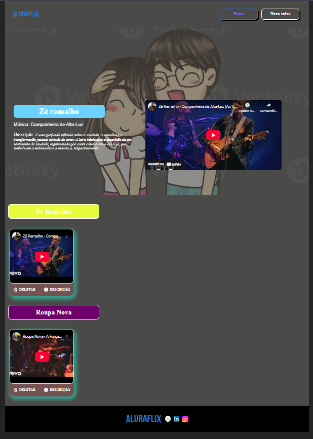

# AluraFlix

Breve descrição do projeto:

> A AluraFlix é um Site onde você pode colocar por categoria os videos que desejar, por exemplo: Você pode pegar alguns vídeos de front-end e colocar na categoria Front-End e se aplica a outros vídeos incluindo musicas também e, se você colocar uma imagem ao criar um vidoo ele aparecerá no banner.

---

## 🚀 Tecnologias usadas

- JavaScript   <a href="https://developer.mozilla.org/pt-BR/docs/Web/JavaScript" target="_blank" title="JavaScript">

       </a>
- ReactJS  <a href="https://reactjs.org/" target="_blank" title="React">
  
         </a>

- CSS  <a href="https://developer.mozilla.org/pt-BR/docs/Web/CSS" target="_blank" title="CSS3">
  
         </a>
- SwiperJS
- JSON Server (mock API) api fake que utilizei
- useContext

---

## 📸 Prévia do projeto 

 
 
 
 > Essas imagem mostra uma prévia de como está o site do Alura flix 

---

## 📦 Como instalar

```bash
# Clone o repositório
git@github.com:Diogobispopereira/AluraFlix.git

# Acesse a pasta do projeto
 cd meu-projeto 

# Instale as dependências
npm install

# Inicie o servidor de desenvolvimento
npm run dev

# Inicie a Api de desenvolvimento para poder acessar todo o conteúdo do site 
json-server --watch db.json --port 3000 
